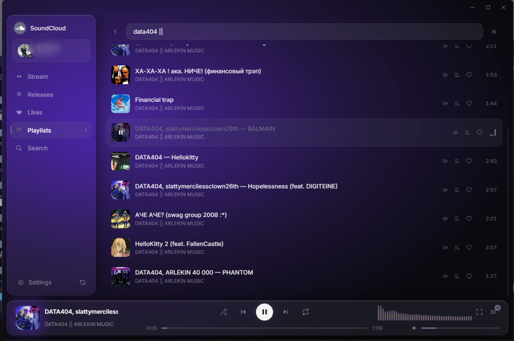
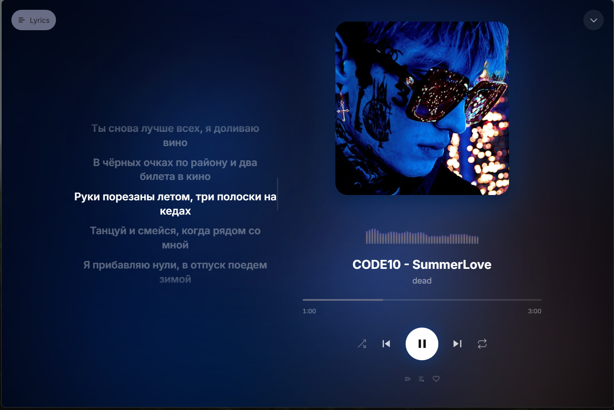
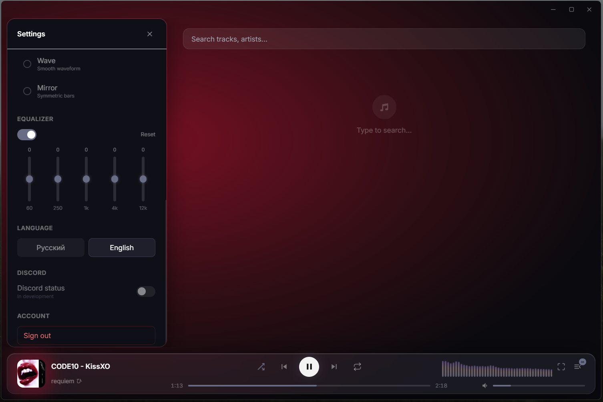
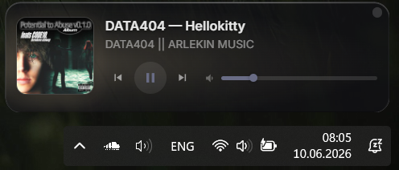
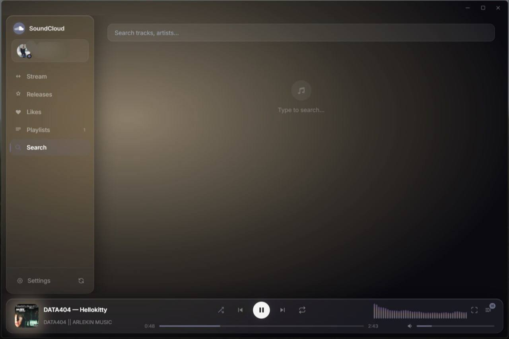
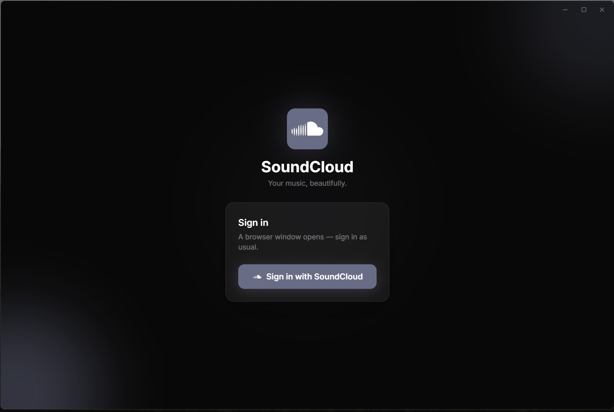

# 🎧 SoundCloud Desktop Player

**Unofficial SoundCloud desktop client for Windows**

A custom player with likes, playlists, follows, a releases feed, synced lyrics, an equalizer, a mini-player and a fullscreen mode.

**English** · [Русский](#-soundcloud-desktop-player-ru)

---

## 📸 Screenshots

<table>
<tr>
<td width="50%"><b>Main window</b> </td>
<td width="50%"><b>Fullscreen mode with lyrics</b> </td>
</tr>
<tr>
<td width="50%"><b>Settings — equalizer, language, themes</b> </td>
<td width="50%"><b>Mini-player</b> </td>
</tr>
<tr>
<td width="50%"><b>Search</b> </td>
<td width="50%"><b>Sign-in screen</b> </td>
</tr>
</table>

---

## ✨ Unique features
- Sort tracks in a playlist and likes: newest first or oldest first
- "Releases" tab — latest releases from the artists you follow
- Synced lyrics with line-by-line time highlighting (LRCLIB)
- 5-band equalizer
- Mini-player in the system tray
- Fullscreen mode with track lyrics and an artwork-based background
- Customizable accent colors and background styles

## 🛠️ Stack
`Electron 32` · `electron-vite` · `React 18` · `TypeScript` · `Zustand` · `Tailwind CSS` · `Web Audio API` · unofficial SoundCloud API v2 · LRCLIB (lyrics).

## 🔒 Security
The app keeps all account and user data locally and talks to SoundCloud directly.

- After sign-in, the OAuth token is stored locally on your machine and used only for requests to SoundCloud. It never goes anywhere else.
- All requests go straight to SoundCloud, like from a normal browser. The app logs nothing and sends nothing to third parties.
- On sign-out, the token and account data are removed from local storage.

## 🏗️ How it works
- **Bypassing DataDome anti-bot protection.** SoundCloud protects its API from automation. Write requests (likes, playlists, follows) aren't sent directly — they're proxied into a hidden window with a live `soundcloud.com` session via `executeJavaScript`, so to the server it looks like a real user acting in a browser.
- **DRM handling.** Distinguishes plain (`progressive`) and encrypted (Widevine HLS) transcodings — unavailable tracks are detected upfront and marked, with no crashes.
- **Smart lyrics matching.** Parses "Artist — Title" from the name plus duration and artist checks, so it won't pull the wrong lyrics for a same-named song.
- **State** — Zustand with persistence in `localStorage` (settings, session, cache).
- **Mini-player** — a separate window synced over IPC.

## ℹ️ About unavailable tracks (DRM)
Some SoundCloud tracks are served only as DRM-encrypted streams (Widevine) and can't be played in a plain `<audio>` element. Such tracks are marked and won't play. This is a SoundCloud limitation, not the app's.

## ⚠️ Disclaimer
Unofficial app, not affiliated with or endorsed by SoundCloud. It works through SoundCloud's private API, so use it at your own risk. Made for educational purposes, non-commercial.

---
---

# 🎧 SoundCloud Desktop Player (RU)

**Неофициальный десктоп-клиент SoundCloud для Windows**

Собственный плеер с лайками, плейлистами, подписками, лентой релизов, синхронизированным текстом, эквалайзером, мини-плеером и полноэкранным режимом.

[English](#-soundcloud-desktop-player) · **Русский**

---

## 📸 Скриншоты

<table>
<tr>
<td width="50%"><b>Главное окно</b> </td>
<td width="50%"><b>Полноэкранный режим с текстом</b> </td>
</tr>
<tr>
<td width="50%"><b>Настройки — эквалайзер, язык, темы</b> </td>
<td width="50%"><b>Мини-плеер</b> </td>
</tr>
<tr>
<td width="50%"><b>Поиск</b> </td>
<td width="50%"><b>Экран входа</b> </td>
</tr>
</table>

---

## ✨ Уникальные функции клиента
- Сортировка треков в плейлисте и лайках: сначала новые или сначала старые
- Вкладка «Релизы» — последние релизы артистов, на которых подписан
- Синхронизированный текст песни с подсветкой строк по времени (LRCLIB)
- 5-полосный эквалайзер
- Мини-плеер в трее
- Полноэкранный режим с текстом трека и фоном из обложки
- Настраиваемые акцентные цвета и стили фона

## 🛠️ Стек
`Electron 32` · `electron-vite` · `React 18` · `TypeScript` · `Zustand` · `Tailwind CSS` · `Web Audio API` · неофициальный SoundCloud API v2 · LRCLIB (тексты).

## 🔒 Безопасность
Приложение хранит все данные об аккаунте и пользователе локально и работает с сервисами SoundCloud напрямую.

- OAuth-токен после входа сохраняется локально на компе и используется только для запросов к SoundCloud. Он не уходит никуда ещё.
- Все запросы идут напрямую к SoundCloud, как из обычного браузера. Приложение ничего не логирует и не отправляет на сторону.
- При выходе из аккаунта токен и данные аккаунта удаляются из локального хранилища.

## 🏗️ Как устроено
- **Обход антибот-защиты DataDome.** SoundCloud защищает API от автоматизации. Write-запросы (лайки, плейлисты, подписки) выполняются не напрямую, а проксируются в скрытое окно с живой сессией `soundcloud.com` через `executeJavaScript` — для сервера это выглядит как действие настоящего пользователя в браузере.
- **Обработка DRM.** Различает обычные (`progressive`) и зашифрованные (Widevine HLS) транскодинги — недоступные треки определяются заранее и помечаются, без падений.
- **Умный матчинг текстов.** Парсинг «Артист — Трек» из названия + проверка по длительности и артисту, чтобы не подтянуть чужой текст у одноимённой песни.
- **Состояние** — Zustand с персистом в `localStorage` (настройки, сессия, кэш).
- **Мини-плеер** — отдельное окно, синхронизация по IPC.

## ℹ️ Про недоступные треки (DRM)
Часть треков SoundCloud отдаёт только в DRM-зашифрованном виде (Widevine) — их нельзя воспроизвести в обычном `<audio>`. Такие треки помечаются и не проигрываются. Это ограничение SoundCloud, а не приложения.

## ⚠️ Дисклеймер
Неофициальное приложение, не связано с SoundCloud и не одобрено им. Работает через закрытый API SoundCloud, поэтому используйте на свой страх и риск. Создано в учебных целях, без коммерческого использования.
